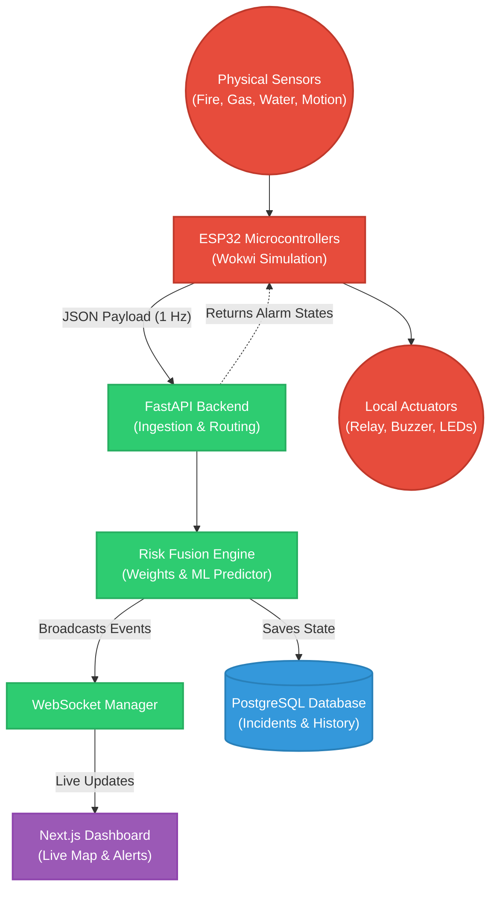
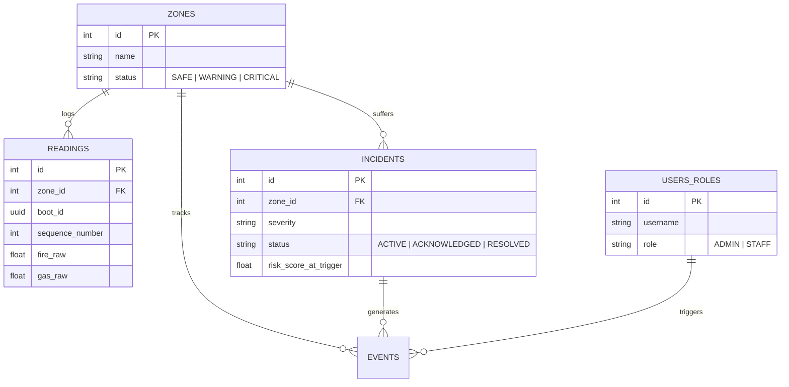

<div align="center">
  <h1>🔥 Sentinel Core IoT Hazard Monitoring System</h1>
  <p><strong>Next-Generation, Real-Time Industrial Hazard Detection & Mitigation</strong></p>
  
  <p>
    <a href="https://fastapi.tiangolo.com"></a>
    <a href="https://nextjs.org"></a>
    <a href="https://www.postgresql.org/"></a>
    <a href="https://scikit-learn.org/stable/"></a>
    <a href="https://wokwi.com/"></a>
  </p>
</div>

---

## 📖 Table of Contents
- [System Overview](#-system-overview)
- [Architecture](#-architecture)
- [Database Schema](#-database-schema)
- [Key Features](#-key-features)
- [Tech Stack](#-tech-stack)
- [Local Development Setup](#-local-development-setup)
- [Hardware Simulation (Wokwi)](#-hardware-simulation-wokwi)
- [API Endpoints](#-api-endpoints)

---

## 🔭 System Overview

Sentinel Core is a highly concurrent, event-driven IoT architecture designed to detect, track, and mitigate industrial hazards (Fire, Gas, Water leaks) in real-time. 

Instead of traditional polling architectures, Sentinel Core utilizes **WebSocket telemetry streams**, **Machine Learning risk prediction**, and **Asynchronous Postgres connection pooling** to process thousands of sensor readings per second and trigger hardware actuators (Buzzers, Relays, Sprinklers) with sub-100ms latency.

---

## 🏗 Architecture



---

## 🗄 Database Schema

The database is fully normalized to **3NF** with strict referential integrity (`ON DELETE RESTRICT`), optimized partial indexes for incident querying, and race-condition prevention via `UNIQUE` constraints.



---

## ✨ Key Features

- **⚡ Sub-100ms Hardware Actuation**: The ESP32 parses the JSON response of its own POST request to instantly trigger hardware relays, entirely bypassing the need for secondary polling endpoints.
- **🧠 ML-Driven Risk Engine**: Implements an `IsolationForest` anomaly detection algorithm and an `XGBoost` classifier to predict critical sensor patterns based on a sliding 5-second window, injecting bonus risk multipliers into the static scoring engine.
- **🗣 Natural Language Incident Reporting**: Security staff can type plain English (e.g., *"Huge fire in the Server Room"*). The backend LLM parser analyzes the text to determine the hazard type and automatically force a zone into a `CRITICAL` state.
- **🔒 Idempotent Packet Processing**: ESP32 packet drops and duplicates are mitigated at the database level using `ON CONFLICT (zone_id, boot_id, sequence_number) DO NOTHING`.
- **🛡 Role-Based Access Control (RBAC)**: Enforced at both the React UI layer and the FastAPI endpoint layer. Staff can acknowledge incidents; only Admins can execute manual zone overrides.

---

## 💻 Tech Stack

| Tier | Technologies |
| :--- | :--- |
| **Hardware** | ESP32, Wokwi Simulator, C++, `HTTPClient` |
| **Backend API** | Python, FastAPI, Uvicorn, Pydantic |
| **Machine Learning** | Scikit-Learn, Joblib, Random Forest |
| **Database** | PostgreSQL, `asyncpg` (Connection Pooling) |
| **Frontend** | React, Next.js (App Router), TailwindCSS, Framer Motion |
| **Real-Time** | WebSockets, `useWebSocket` hook |

---

## 🚀 Local Development Setup

We use `make` for streamlined orchestration.

1. **Clone the repository:**
   ```bash
   git clone https://github.com/IsTu25/Robofusion-.git
   cd Robofusion-
   ```

2. **Boot the PostgreSQL Database:**
   ```bash
   docker-compose up -d
   ```

3. **Install Dependencies & Seed Database:**
   ```bash
   make setup
   ```

4. **Start the Stack (Backend + Frontend):**
   ```bash
   make run
   ```
   - **Frontend:** [http://localhost:3000](http://localhost:3000)
   - **Backend API Docs:** [http://localhost:8000/docs](http://localhost:8000/docs)

---

## 🔌 Hardware Simulation (Wokwi)

To simulate physical IoT nodes pushing real data into your local backend:
1. Start your tunneling service to expose your backend to the internet (e.g., `ngrok http 8000`).
2. Open `hardware/esp32/sketch.ino`.
3. Update the `serverName` variable with your ngrok/localtunnel URL:
   ```cpp
   String serverName = "https://your-url.ngrok.dev/api/zones/1/readings/";
   ```
4. Copy the code into the [Wokwi ESP32 Simulator](https://wokwi.com/projects/new/esp32).
5. Paste the contents of `hardware/esp32/diagram.json` into the Wokwi diagram tab to load the LEDs, Potentiometers, and Relays.
6. Click **Play**.

---

## 📡 API Endpoints

A fully auto-generated OpenAPI (Swagger) interface is available at `/docs` when the backend is running.

| Method | Endpoint | Description | Auth Required |
| :--- | :--- | :--- | :--- |
| `POST` | `/api/zones/{id}/readings` | Ingest high-frequency telemetry. | `X-Zone-API-Key` |
| `GET` | `/api/zones` | Fetch current status of all zones. | None |
| `POST` | `/api/zones/{id}/incidents/acknowledge` | Acknowledge active incident. | Bearer Token (Staff/Admin) |
| `POST` | `/api/zones/{id}/override` | Manually force zone state. | Bearer Token (Admin) |
| `POST` | `/api/nl-report` | Natural Language emergency parser. | Bearer Token (Staff/Admin) |

---
*Built by Team Antigravity.*
